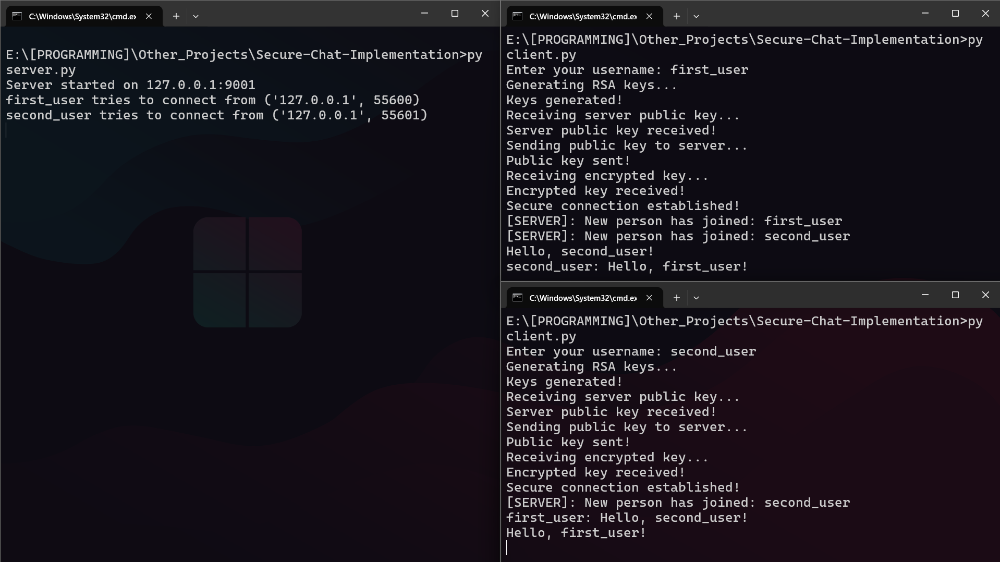

# Secure Chat Implementation

A comprehensive secure chat application implementing various cryptographic techniques to provide secure, authenticated messaging between multiple clients.

## Overview

This project implements a client-server chat application with strong security features:

- RSA for key exchange and digital signatures
- Message integrity verification with SHA-256 hashes
- Hybrid cryptography (RSA + symmetric encryption)
- Secure protocol for handling large messages

## Tasks Distribution

- **Marharyta Paduchak**: RSA algorithm implementation, including key generation, encryption/decryption functions
- **Arsenii Stratiuk**: Chat protocol, message encryption/decryption, digital signature mechanisms, network communication layer

## Features in Detail

### 1. End-to-End Security

The chat implements a secure communication channel between clients:

- RSA (1024-bit) is used for initial key exchange
- Each client session uses a unique 128-bit symmetric key
- Server acts primarily as a message router rather than having access to message content

### 2. Digital Signatures

All messages are digitally signed to verify authenticity:

- The sender hashes each message with SHA-256
- The hash is signed with the sender's private key
- Recipients can verify the signature using the sender's public key

### 3. Message Integrity

Hash verification ensures messages haven't been damaged during transmission:

- Each message includes its SHA-256 hash
- Recipients recalculate the hash and compare it with the received hash
- Any modification to the message in transit would result in hash mismatch
- The system alerts users when message integrity verification fails

### 4. Large Message Handling

The application implements a custom protocol for transmitting large messages:

- Message length is sent as an 8-byte prefix
- Data is transmitted in chunks (4096 bytes)
- Chunks are reassembled at the destination
- This allows handling of large RSA keys and messages without truncation

## System Architecture

### Client-Server Model

The application follows a client-server architecture:

1. **Server Module**:
   - Manages client connections
   - Routes messages between clients
   - Coordinates the secure exchange of cryptographic keys
   - Tracks connected users and broadcasts join/leave events
   - Handles client disconnections

2. **Client Module**:
   - Handles user interaction via command line
   - Manages secure communication with the server
   - Performs cryptographic operations for message security
   - Runs separate threads for reading and writing messages

3. **RSA Module**:
   - Provides core cryptographic primitives
   - Implements key generation, encryption, and decryption
   - Handles digital signature creation and verification
   - Uses Miller-Rabin primality test for key generation

## Security Protocol Details

### Connection Establishment

The secure connection follows these steps:

1. Client connects to server and provides a username
2. Client and server generate their RSA key pairs independently
3. Public keys are exchanged between client and server
4. Server generates a unique 128-bit symmetric key for the client session
5. Server encrypts this symmetric key with the client's public key
6. Server signs the encrypted key with its private key for authentication
7. Client verifies the signature to authenticate the server
8. Client decrypts the symmetric key with its private key
9. A secure channel is now established

### Message Exchange Protocol

For every message sent:

1. **Sender Side**:
   - User enters a message
   - Application calculates SHA-256 hash of the message
   - Hash is signed with the sender's private key
   - A message package is created containing:
     - Message content
     - Sender username
     - Message hash
     - Digital signature

2. **Server Side**:
   - Receives the message package
   - Verifies message integrity using the hash
   - Forwards the intact package to other clients
   - No decryption or modification of the message occurs

3. **Recipient Side**:
   - Receives the message package
   - Verifies message integrity by comparing hashes
   - For server messages, verifies signature with server's public key
   - Displays the message if verification succeeds

## Technical Implementation

### RSA Implementation

Our custom RSA implementation includes:

- Prime number generation using the Miller-Rabin primality test
- 1024-bit key length for balance between security and performance
- Functions for encryption, decryption, signing, and verification
- Extended Euclidean algorithm for key generation

### Threading Model

The application uses a multi-threaded approach:

- Server spawns a new thread for each client connection
- Each client runs separate threads for:
  - Reading messages from the server
  - Capturing and sending user input

### Data Transfer Protocol

To handle large messages reliably:

1. The sender first transmits the message length (8 bytes)
2. The receiver prepares to receive the specified number of bytes
3. Data is transmitted in manageable chunks
4. The receiver assembles the chunks into the complete message
5. JSON is used for structured message formatting

## Usage

### Starting the server

```python
python server.py
```

### Starting a client

```python
python client.py
```

When prompted, enter your desired username. By default, the client connects to 127.0.0.1:9001.

## Security Considerations

While this implementation provides strong security, users should be aware of these considerations:

1. **Key Generation**: Initial connection involves computationally expensive RSA key generation
2. **Performance**: Custom RSA implementation prioritizes educational value over optimization
3. **Forward Secrecy**: The current implementation does not provide perfect forward secrecy
4. **User Authentication**: The system uses simple usernames without password verification

## Known Limitations

1. No persistent message history (messages are not stored)
2. Limited to text-based messages
3. Command-line interface only
4. No support for direct messaging between specific users

## Future Improvements

Potential enhancements for future versions:

1. Replace custom RSA with optimized libraries
2. Implement group chat capabilities with efficient broadcast encryption
3. Add robust user authentication with password protection
4. Develop a graphical user interface
5. Add encrypted message storage

## Usage Example



## References

- [Everything Crypto](https://github.com/zademn/EverythingCrypto)
- RSA algorithm: Rivest, Shamir, and Adleman (1978)
- SHA-256: NIST FIPS PUB 180-4
